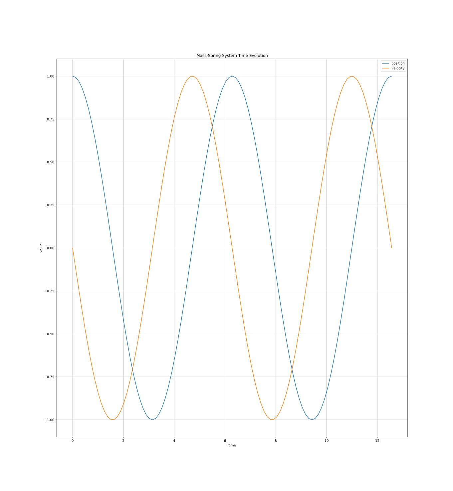
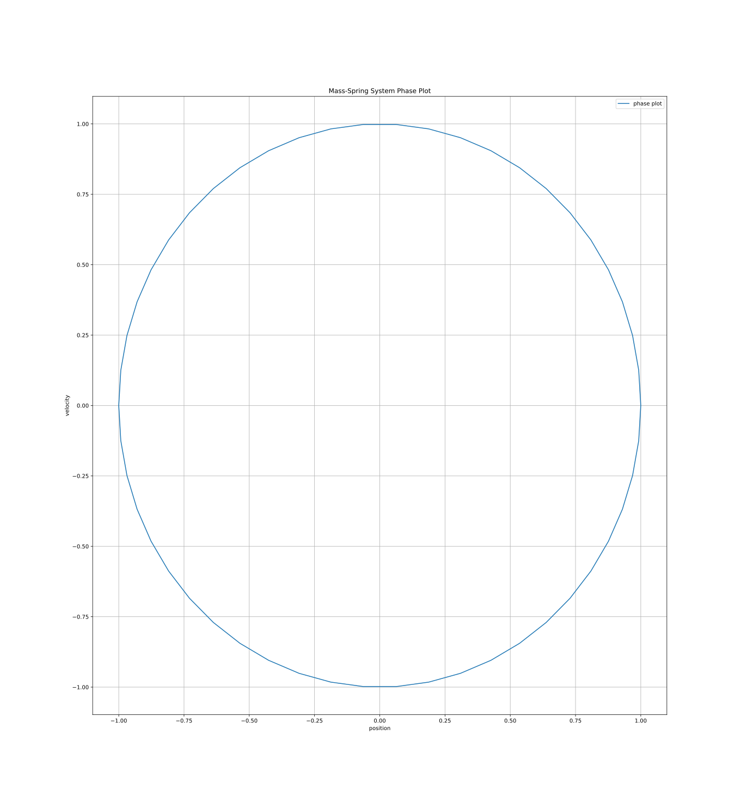

# Exercise 19 — Runge–Kutta Comparison on the Mass–Spring ODE

## Explicit Runge–Kutta methods

### Explicit RK4 (classic, 4-stage)
- Tracks the exact oscillation closely; phase plot is almost perfectly elliptical.

Time | Phase
:---:|:----:
 | 

## Implicit Runge–Kutta (Gauss/Radau)

### Gauss–Legendre 2-stage
- Symplectic and A-stable; good energy behavior with tight ellipse.

Time | Phase
:---:|:----:
 | 

### Gauss–Legendre 3-stage
- Higher order reduces phase error further; trajectory nearly overlays the reference.

Time | Phase
:---:|:----:
 | 

### Arbitrary-order Gauss–Legendre
- Very high accuracy over the 4π window; ellipse visually matches the analytical solution.

Time | Phase
:---:|:----:
 | 

### Arbitrary-order Radau IIA
- L-stable; noticeable damping as expected for stiff-friendly schemes.

Time | Phase
:---:|:----:
 | 

